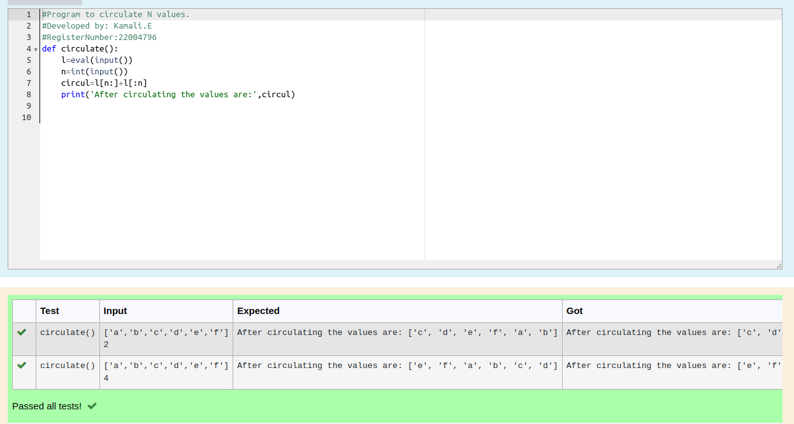

# Circulate-the-values-of-N-variables

## Aim:

To write a python program to circulate the n variables using function concept
## Equipment’s required:

PC
Anaconda - Python 3.7

## Algorithm: 

### Step 1: 
Get the list of values from the user 
### Step 2:
Get the value from the user for the number of rotation 
### Step 3: 
Declare a function starting with a keyword 'def'
### Step 4: 
Using the slicing concept rotate the list

### Stes5
using the slicing concept rotate the list

### Step 6: 
Display the output.
## Program:
```python
#Program to circulate N values.
#Developed by: Kamali.E
#RegisterNumber:22004796
def circulate():
    l=eval(input())
    n=int(input())
    circul=l[n:]+l[:n]
    print('After circulating the values are:',circul)
```


## Output:


## Result:
Thus the Circulate the values of n variables are successfully executed
